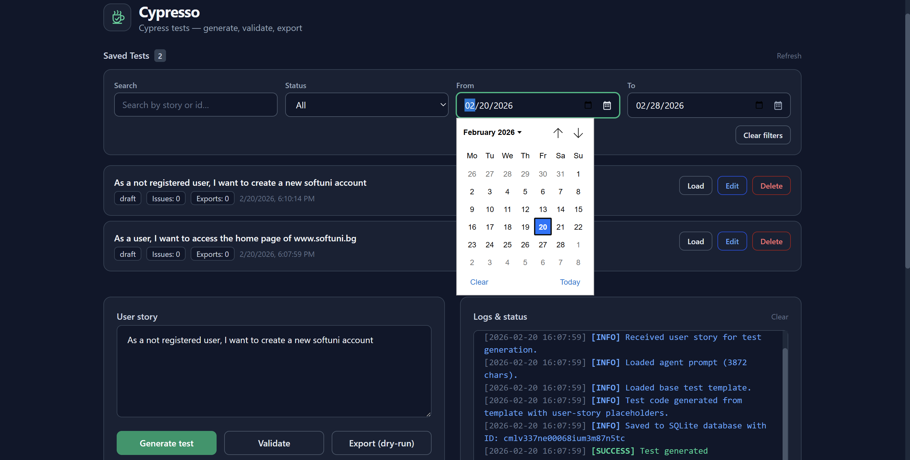
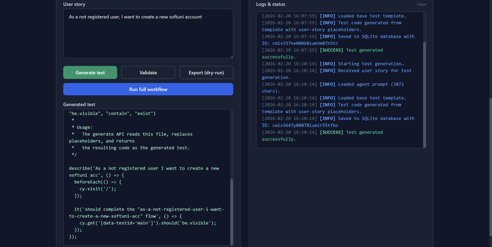
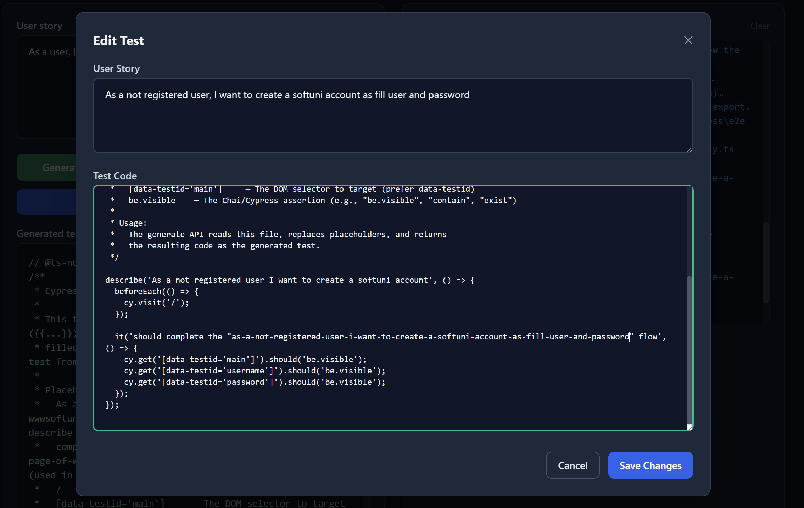
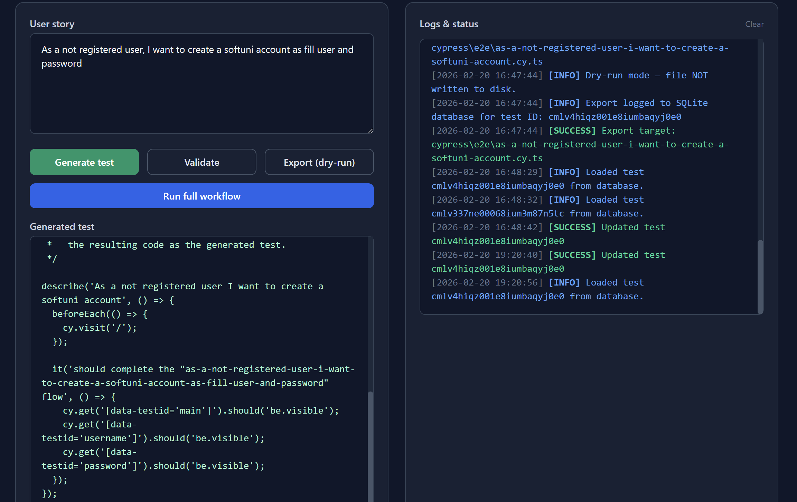

#  Cypresso

Cypresso is a Cypress test generation workspace that turns user stories into TypeScript-based Cypress E2E tests. It includes a Next.js web dashboard, API routes that orchestrate generation/validation/export steps, an agent/skill system for modular prompts and rules, and a SQLite database for persistent test storage.

## What This Project Includes

- Web dashboard (Next.js App Router + React + TailwindCSS + TypeScript)
- API routes for generate, validate, export, feedback, and test management (CRUD + filter/search)
- SQLite database via Prisma ORM for persistent test storage
- Agent prompts in `agents/` (TestGenerator, Export, QAValidation, UIFeedback, TestManager)
- Skill rules in `skills/` (validate-test, export-test, ui-feedback, filter-tests)
- Global instructions in `instructions/`
- Workflow plan in `plans/`
- Cypress test template in `templates/`

## Quick Start

```bash
cd Cypresso
npm install
npm run prisma:migrate   # creates prisma/dev.db and all tables
npm run dev
```

Open `http://localhost:3000` to use the dashboard.

## How Cypresso Works

The default workflow (dry-run) is:

1. **Generate**: Convert a user story into Cypress test code and save it to the SQLite database.
2. **Validate**: Check syntax, structure, and idempotence. Persist validation issues to the database.
3. **Export**: Compute the export path (dry-run by default) and log the export to the database.
4. **Feedback**: Summarize the run and provide next steps.

All generated tests are persisted across sessions and viewable in the **Saved Tests** panel on the dashboard.

## Using the Web UI

### Generate & Validate Tests

1. Enter a user story in the textarea.
2. Click **Generate Test** — the test is saved to the database automatically.
3. Optional: click **Validate** to check the generated test (issues saved to database).
4. Optional: click **Export (Dry-Run)** to preview where the test would be written (export logged to database).
5. Optional: click **Run Full Workflow** to run all steps in sequence.

The logs panel shows step-by-step status in real time.

### Filter & Search Saved Tests

The **Saved Tests** panel includes filter controls to search and organize your test library:

- **Search**: Case-insensitive text search across user story and test code.
- **Status**: Filter by `All`, `Draft`, or `Exported`.
- **Date Range**: Filter by creation date using date pickers.
- **Clear Filters**: Reset all filters to show the complete test list.

Filters compose automatically — search + status + date range all apply together. The result count updates as you filter.

### Load, Edit, or Delete Tests

Each test card in the **Saved Tests** panel has three action buttons:

- **Load**: Populate the editor with the saved test (user story + test code + testId).
- **Edit**: Open a modal to update the user story and/or test code. Changes are saved to the database immediately.
- **Delete**: Remove the test from the database (cascade deletes validation issues and export logs).

After editing or deleting, the test list refreshes automatically.

## API Endpoints

All endpoints accept and return JSON.

- `POST /api/generate`
  - Input: `{ "userStory": "..." }`
  - Output: `{ testCode, testId, status, logs }`
  - Saves generated test to database. Returns `testId` for tracking.

- `POST /api/validate`
  - Input: `{ "testCode": "...", "testId"?: "..." }`
  - Output: `{ valid, issues, logs }`
  - If `testId` is provided, saves validation issues to database.

- `POST /api/export`
  - Input: `{ "testCode": "...", "testId"?: "...", "targetPath"?: "..." }`
  - Output: `{ exportedPath, status, logs }`
  - If `testId` is provided, logs export and updates test status in database.

- `POST /api/feedback`
  - Input: `{ "logs": ["..."], "status": "success|error|unknown" }`
  - Output: `{ summary, recommendations }`

- `GET /api/tests`
  - Query params (all optional): `search`, `status` (`draft`|`exported`), `dateFrom` (YYYY-MM-DD), `dateTo` (YYYY-MM-DD)
  - Output: `{ tests, status, count }` — filtered saved tests with validation issues and export logs.
  - Example: `GET /api/tests?search=login&status=draft&dateFrom=2026-01-01`

- `GET /api/tests/[testId]`
  - Output: `{ test, status }` — single test with full history.

- `PUT /api/tests/[testId]`
  - Input: `{ "userStory"?: "...", "testCode"?: "..." }` (at least one field required)
  - Output: `{ test, status }` — updated test with refreshed `updatedAt` timestamp.
  - Preserves existing status, validation issues, and export logs.

- `DELETE /api/tests/[testId]`
  - Output: `{ status }` — deletes test and all related records (cascade delete).

## Database

Cypresso uses **SQLite** via **Prisma ORM** for zero-setup persistent storage.

### Schema

| Table             | Purpose                                                                     |
| ----------------- | --------------------------------------------------------------------------- |
| `GeneratedTest`   | Stores user stories, generated test code, and status (`draft` / `exported`) |
| `ValidationIssue` | Stores validation issues linked to a test                                   |
| `ExportLog`       | Stores export history linked to a test                                      |

### Database File

The database is a single file at `prisma/dev.db`. It is excluded from version control via `.gitignore`.

### Useful Commands

```bash
npm run prisma:migrate    # apply schema changes and create/update dev.db
npm run prisma:generate   # regenerate the Prisma client after schema edits
npm run prisma:studio     # open the Prisma database GUI in the browser
npm run prisma:reset      # reset the database (development only)
```

### Environment

Two env files are used:

- `.env` — read by the Prisma CLI (`migrate`, `studio`, `generate`)
- `.env.local` — read by Next.js at runtime

Both set `DATABASE_URL="file:./dev.db"`. Neither is committed to version control.

## Dry-Run Mode (Generate Only)

Dry-run mode is the default for this bootstrap project.

- No files are written to external target projects.
- Export returns the intended path only.
- Validation uses static checks (no Cypress run).

To switch to live behavior later, update the API routes to perform actual writes and execution.

## File Layout

```
Cypresso/
  agents/
    TestGeneratorAgent.md
    ExportAgent.md
    QAValidationAgent.md
    UIFeedbackAgent.md
    TestManagerAgent.md    ← Manages filter, search, update, delete
  instructions/
  plans/
  prisma/
    schema.prisma
    dev.db          ← SQLite database (git-ignored)
    migrations/
  skills/
    validate-test.md
    export-test.md
    ui-feedback.md
    filter-tests.md       ← Search and filter rules
  templates/
  src/
    app/
      api/
        generate/
        validate/
        export/
        feedback/
        tests/
          route.ts        ← GET with filters + search
          [testId]/
            route.ts      ← GET, PUT (update), DELETE
    lib/
      db.ts         ← Prisma client singleton
  .env              ← Prisma CLI env
  .env.local        ← Next.js runtime env
```

## Customization Tips

- Update agent prompts in `agents/` to control test generation style.
- Extend validation rules in `skills/validate-test.md`.
- Adjust filter/search rules in `skills/filter-tests.md`.
- Adjust export behavior in `src/app/api/export/route.ts`.
- Update UI copy and layout in `src/app/page.tsx`.
- Add new filter types: extend filter controls in `src/app/page.tsx` and filter logic in `src/app/api/tests/route.ts`.
- Modify the database schema in `prisma/schema.prisma`, then run `npm run prisma:migrate`.

## Troubleshooting

- If the UI does not load, verify `npm install` completed and run `npm run dev`.
- If the database is missing, run `npm run prisma:migrate` to create `prisma/dev.db`.
- If Prisma client is out of sync after schema changes, run `npm run prisma:generate`.
- If logs show validation warnings, review the generated test and refine the user story or validation rules.
- If export paths look wrong, update the `targetPath` in the export request or adjust the export agent rules.
- If search is not finding tests, verify the search text is in the user story or test code (search is case-insensitive).
- If date range filter is not working, ensure dates are in `YYYY-MM-DD` format. The UI date pickers handle this automatically.
- If edit/update fails, check the browser console for error messages and verify the test exists (testId is valid).








